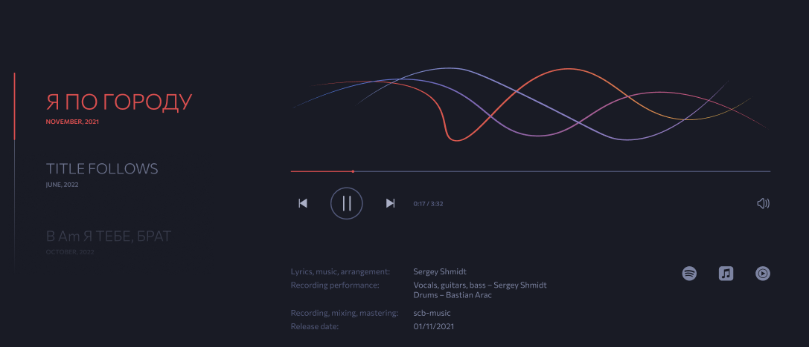

# Музыкальный сайт-визитка Sergey Shmidt

Данный проект - музыкальный сайт Sergey Shmidt

Ссылка на дизайн - [фигма](https://www.figma.com/file/XtfMmNvL8K3pWlq2oKF7lU/Sergey-Shmidt-Official-Web-Site?node-id=697%3A1327)
Ссылка на сайт - [https://sergeyshmidt.com/](https://sergeyshmidt.com/)

## Технологический стек

- HTML, предпроцессор SCSS
- JavaScript, React

## Особенности проекта

Разработка собственного аудиоплеера с помощью canvas.


## Инструкция как добавить песню на сайт

1. добавить аудиофайл в папку [src/public](src/public)
2. В файле [SongsPage.js](src/component/SongsPage/SongsPage.js) в массив songsArr добавить объект песни

```js
    {
        title: "название песни",
        audio: audio1,
        Lyrics: 'дополнительные поля информации',
        recordingPerformance: `дополнительные поля информации`,
        Recording: `дополнительные поля информации`,
        releaseDateText: 'MAY, 2022',
        releaseDate: '2022/05/13',
        spotify: "ссылка на spotify",
        appleMusic: "ссылка на appleMusic",
        youtube: "ссылка на youtube",
        disabled: false, // флаг заблокированная песня или нет
        parameters: [ // данные параметры нужны для анимации плеера
        {
            // параметры для первой волны
            amplitude: 55,  // начальная амплитуда
            amplitudeMax: 75, // amplitude max - 100
            amplitudeMin: 50,// amplitude min - -100
            amplitudeIncrease: true,
            frequency: 0.95, //   Частота  frequency max - 1 min - 0.4
            offset: 150, // смещение по горизонтали
        },
        {
            // аналогично для 2 волны
        },
        {
            // аналогично для 3 волны
        },
        ],
  },
```

3. собрать проект командой npm run build и выложить на хостинг

## Инструкция как добавить стихотворение на сайт

1. В файле [PoemsPage.js](src/component/PoemsPage/PoemsPage.js) в массив poemsArr добавить объект песни

```js
    {
        title: 'Название песни',
        text: `текст песни`,
    },
```

2. собрать проект командой npm run build и выложить на хостинг

## Инструкция как развернуть проект

- Клонируйте или скачайте репозиторий: https://github.com/DianaIvanovna/music-website.git
- Предварительно установите node.js
- Установите необходимые пакеты командой: npm i
- Запустите локальный сервер командой: npm run start
